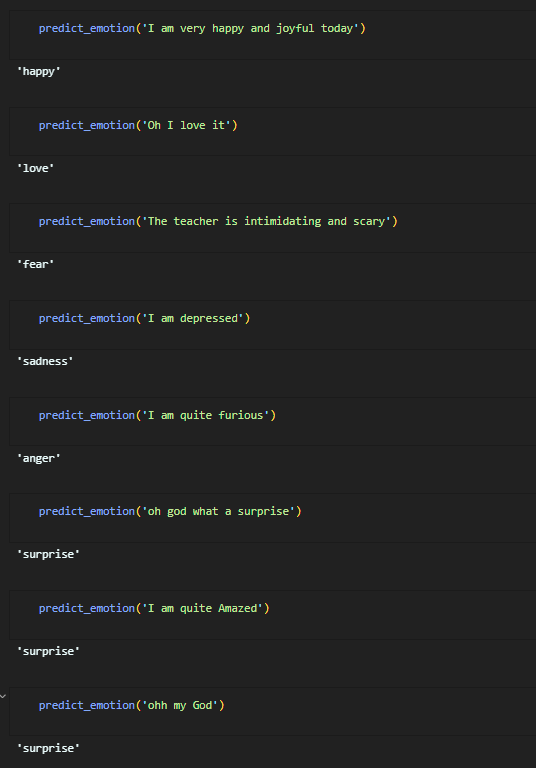
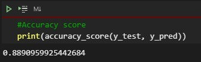
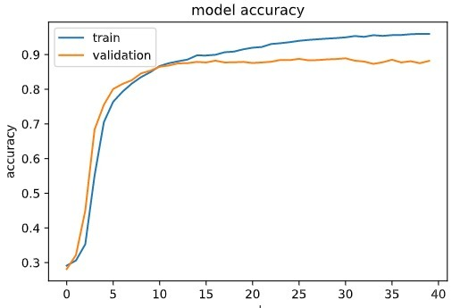
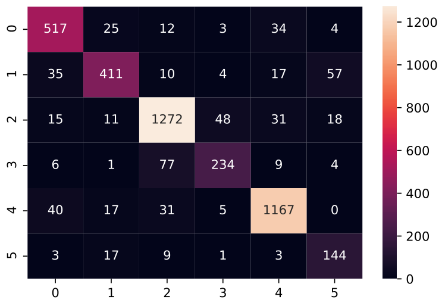
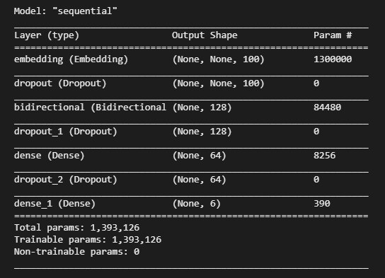
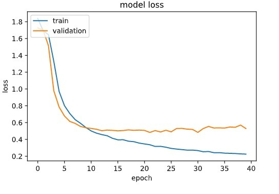

# Sentiment-Analysis

Finding emotions from text with 88.9% accuracy in a corpus of almost 22 thousand unique sentences.
Classifying 6 different emotion from text by using a Sequentially trained Keras model having Bi-Directional LSTM layer.

**Run each section in:**
  Small_Dataset.ipynb
  Medium_dataset.ipynb
  Huge_Dataset.ipynb
_________________________________________________________________________________________________________________________________________________

**Results**  
  
_________________________________________________________________________________________________________________________________________________

**Accuracy and Accuracy Graphs**  
  
  
  
_________________________________________________________________________________________________________________________________________________

**Model Summary and Model Loss**  
  
  
_________________________________________________________________________________________________________________________________________________

**Tools / Libraries**  
1: Tensorflow  
2: Sklearn  
3: NLTK  
4: Seaborn  
5: Pandas  
6: Matplotlib  
7: Numpy  
